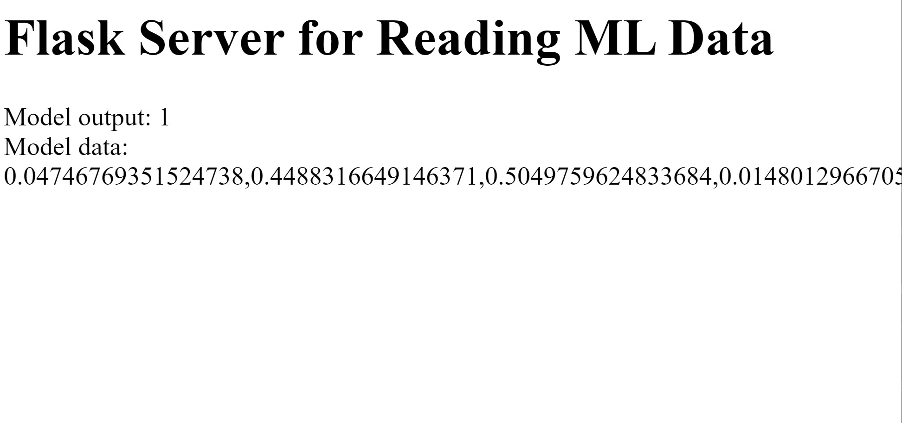

Awesome-Flask-Server
Flask Server which gets Python code from the server and outputs it on the client side using JQuery AJAX requests

How to run:
  1. Install Python dependencies from `requirements.txt` (`pip install -r requirements.txt`)
  2. Add `FLASK_APP=server.py` to `PATH` (`export FLASK_APP=server.py` in bash terminal)
  3. navigate to root directory and execute `flask run`
"# minthome" 
"# minthome" 
